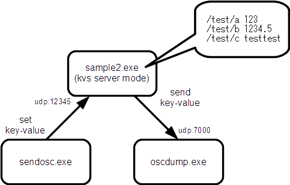

libOSCConfig
====
libOSCConfig is simple KVS server using liboscpack.

usage
====

store
----
sample1-main.cpp
<pre>
#include "OSCConfig.h"

int main(int argc, char* argv[])
{
	OSCConfig config;

	config.start(12345);

	while (true) {
		bool  b = config.get_bool("/test/bool");
		int   i = config.get_int("/test/int");
		float f = config.get_float("/test/float");
		std::string s = config.get_string("/test/string");

		printf("b=%s, i=%d, f=%f, s=\"%s\"\n", b ? "true" : "false", i, f, s.c_str());
		::Sleep(500);
	}

	return 0;
}
</pre>

sendosc.exe
<pre>
&gt; sendosc.exe localhost 12345 /test/bool b true
&gt; sendosc.exe localhost 12345 /test/int i 12345
&gt; sendosc.exe localhost 12345 /test/float 1234.5
&gt; sendosc.exe localhost 12345 /test/string s teststring...
</pre>

kvs server mode
----

sample2-main.cpp
<pre>
#include "OSCConfig.h"

void main()
{
	OSCConfig config;
	config.start_kvs_mode(12345);
}
</pre>

sendosc.exe (set key-value)
<pre>
&gt; sendosc.exe localhost 12345 /test/a i 123
&gt; sendosc.exe localhost 12345 /test/b f 1234.5
&gt; sendosc.exe localhost 12345 /test/c s testtest
  .
  .
  .
</pre>

sendosc.exe (get key-value)
<pre>
&gt; sendosc.exe localhost 12345 /get/int/7000 s /test/a
&gt; sendosc.exe localhost 12345 /get/float/7000 s /test/b
&gt; sendosc.exe localhost 12345 /get/string/7000 s /test/c
  .
  .
  .

  magic address pattern :
      /get/[type]
      /get/[type]/[port]
      /get/[type]/[port]/[host]

      type : int, float, bool, string
      port : reply port
      host : reply hostmame (or address)

  argument :
      arg0 (string)  the key of an element in the OSCConfig.

</pre>

oscdump.exe
<pre>
&gt; oscdump.exe
listening for input on port 7000...
press ctrl-c to end</pre>
[/test/a int32:123]
[/test/b float32:1234.5]
[/test/c OSC-string:`testtest']
  .
  .
  .
</pre>

libraries
====
libOSCConfig uses the following libraries.

* liboscpack_1_1_0-vc12
  * https://github.com/yoggy/liboscpack_1_1_0-vc12

* boost 1.56.0
  * http://www.boost.org/
